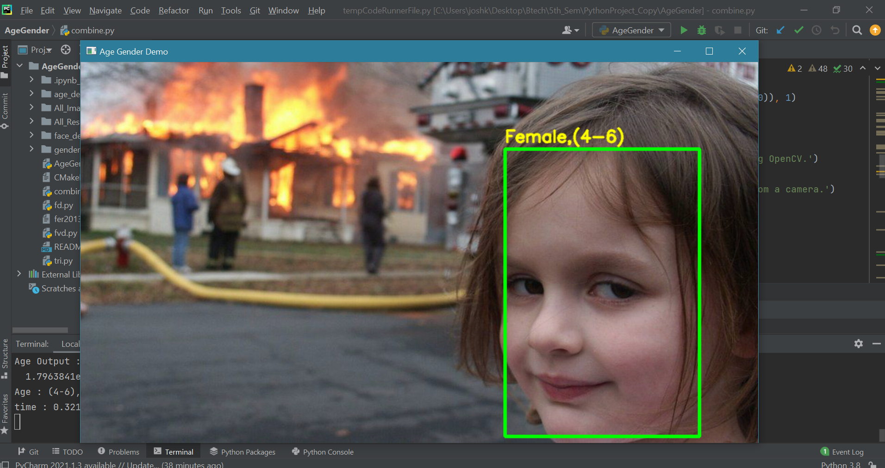

# PYCK PROJECT
# AGE-GENDER DETECTION (PYTHON-OpenCV-DNN)
## Introduction
Online search, shopping, payments, entertainment, social media, and many other technologies came into existence in the past 15-20 years. But it is observed that in the last 5 -6 years, companies are investing heavily in computer vision and machine learning technologies. But why? 
<br />
<br />
To know the needs and requirements of their user and customers more and more. And the more they fulfill their requirements, the more they build customer’s trust and loyalty. Computer vision can be used in securities, traffic control, self-drawing cars, etc. One can do hundreds of things using computer vision: object detection, face detection, age and gender detection, path detection, and many more. Among them, face detection is most valuable and uncomplicated. It is used in apps like Snapchat, identifying criminals in a crowd, security and video surveillance, and privacy of our smartphones. 
<br />
<br />
In this project, We have used Computer vision using Python-OpenCV and DNN. We implement CNN, Deep learning approaches, and OpenCV using Python to achieve robust age group and gender classification of faces. We used a dataset for face photos that include various real-world imaging conditions like noise, lighting, pose, and appearance. We classified people into male and female and different age groups. We have used various online materials for learning about this and implementing it in the most reliable way possible. 
<br />
<br />
## Code Implementation
### Following commands, files and functions were used in our project
* argparse: To take input from the user 
 ```pip install argparse ```
* --input: Provides the path to the input image for age detection
* --confidence: The minimum probability threshold to filter weak detections
*  imultis: Series of convenience functions to make basic image processing functions 
 ```pip install imutils ```

### Command prompt commands to run the  python file
* For images: 
    * python {file_name.py} --input {image_address/image.extension}
* For video stream:
    * Python {file_name.py}
## Result:
 ```
    python AgeGender.py --input All_Images/image_02.jpg
    Gender : Male
    Age : (25-32)
 ```
 
```
    python AgeGender.py --input All_Images/image_08.jpg
    Gender : Female
    Age : (25-32)
 ```
 
 
 ```
    python AgeGender.py --input All_Images/image_10.jpg
    Gender : Female
    Age : (4-6)
 ```
 
 ### Final result
 
 
 
